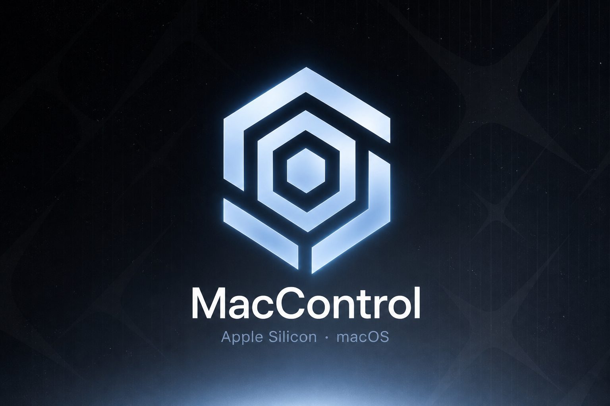
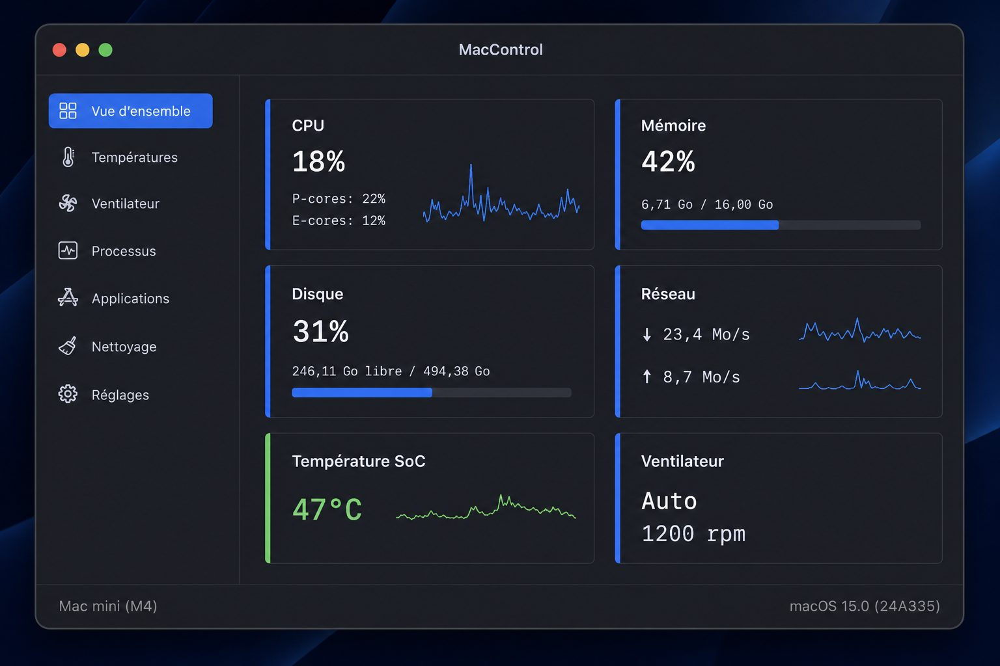
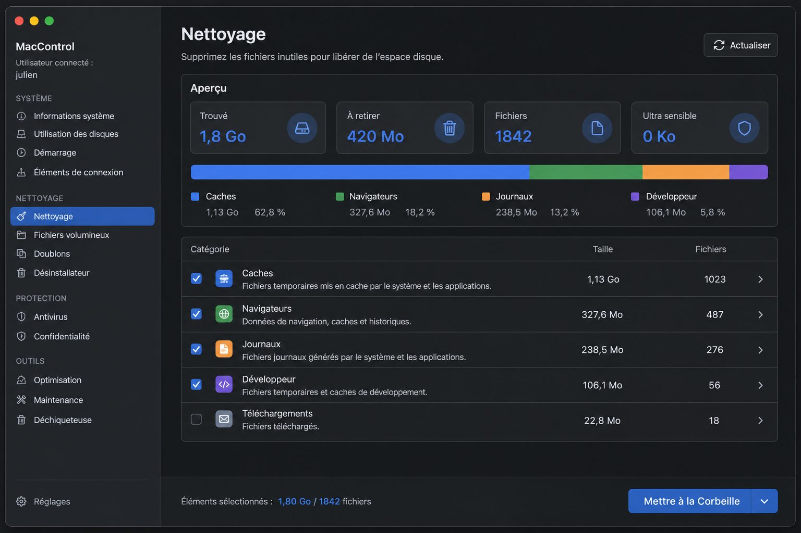
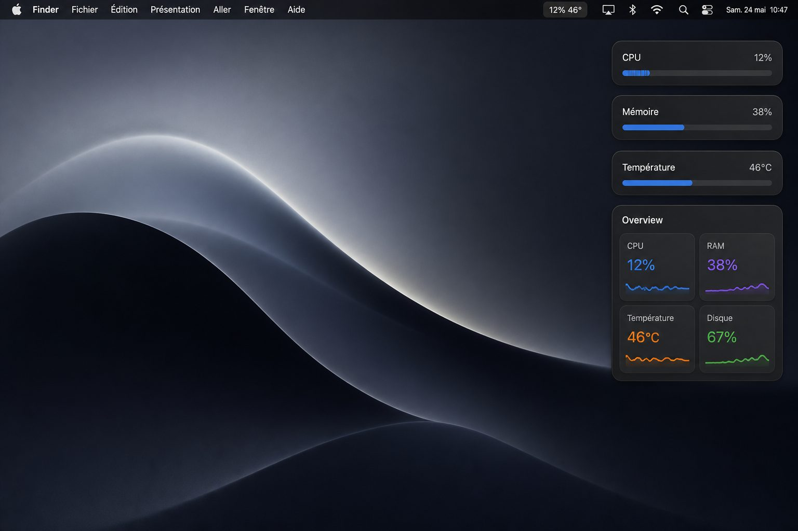

# MacControl

<p align="center">
  
</p>

Utilitaire natif pour Mac Apple Silicon. MacControl affiche l’état de la machine et permet de désinstaller des applications, d’en retirer les fichiers restants, et de libérer de l’espace en envoyant caches et fichiers inutiles à la Corbeille.

Le code source est public. Les versions sont publiées sur GitHub, hors de l’App Store. La licence autorise un usage personnel et éducatif. La revente est interdite.

<p align="center">
  
</p>

## Fonctions

- Vue d’ensemble : processeur (cœurs P et E), mémoire, disque, réseau, températures, batterie
- Ventilateur : lecture via le SMC, réglage manuel après autorisation administrateur
- Processus : liste, recherche, arrêt normal ou forcé
- Applications : contrôle de signature, désinstallation, fichiers restants
- Nettoyage : caches, journaux, restes d’outils de développement, fichiers cachés, aperçu des volumes
- Barre de menus : processeur, mémoire, température, ventilateur, batterie
- Widgets macOS : aperçu, processeur, mémoire, température, ventilateur, batterie, disque
- Apparence : suit le thème clair ou sombre de macOS

<p align="center">
  
</p>

## Configuration requise

- Mac Apple Silicon (M1 et suivants)
- macOS 14 Sonoma ou version ultérieure
- Les Mac Intel ne sont pas pris en charge

L’application a été validée sur Mac mini M4. Les autres modèles Apple Silicon s’appuient sur les mêmes interfaces système.

## Installation

1. Téléchargez `MacControl.dmg` depuis la [dernière version](https://github.com/Mandalorian531/MacControl/releases).
2. Ouvrez l’image disque et placez MacControl dans le dossier Applications.
3. Au premier lancement, cliquez sur l’application avec le bouton droit, puis choisissez Ouvrir.

macOS affiche un avertissement Gatekeeper. Le paquet est signé de manière ad hoc, sans notarisation Apple, faute de compte Developer. Ce comportement est attendu.

## Widgets

<p align="center">
  
</p>

MacControl fournit des widgets WidgetKit : aperçu, processeur, mémoire, température, ventilateur, batterie et disque.

1. Place MacControl dans le dossier Applications, puis lance-le une fois.
2. Clic droit sur le bureau, Modifier les widgets, ou ouvre le Centre de notifications.
3. Cherche MacControl et place les widgets.

Ils suivent le thème, les tailles et le chrome de macOS. Un clic rouvre l’application. La mesure se rafraîchit environ toutes les cinq minutes, plus souvent si MacControl tourne.

## Confidentialité

Aucune donnée ne quitte l’ordinateur. Il n’existe ni compte, ni télémétrie, ni serveur distant.

Les mesures restent locales. Les actions qui modifient le système (réglage du ventilateur, envoi à la Corbeille) demandent une confirmation. Le nettoyage se limite au compte utilisateur. Les dossiers système, le trousseau, Mail et les clés SSH ne sont pas analysés.

## Ventilateur

La vitesse est lue dans le SMC. Un Mac à plusieurs ventilateurs les affiche tous. Un Mac sans ventilateur l’indique.

Le mode manuel demande un mot de passe administrateur lors de la première utilisation. Un régime trop bas peut faire monter la température, en particulier sur un ordinateur portable. Revenez ensuite en mode automatique.

## Compilation

```bash
./scripts/build.sh
./scripts/package-dmg.sh
open dist/MacControl.app
```

Les outils de ligne de commande Apple suffisent. Xcode n’est pas nécessaire.

```bash
make build
make dmg
```

## Licence

[PolyForm Noncommercial 1.0.0](LICENSE). Usage personnel, étude, association et établissement scolaire : autorisé. Vendre MacControl, l’intégrer à un produit payant ou le redistribuer contre rémunération : interdit.
