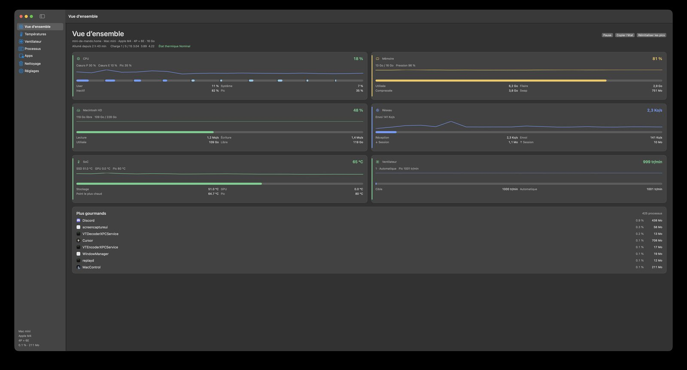
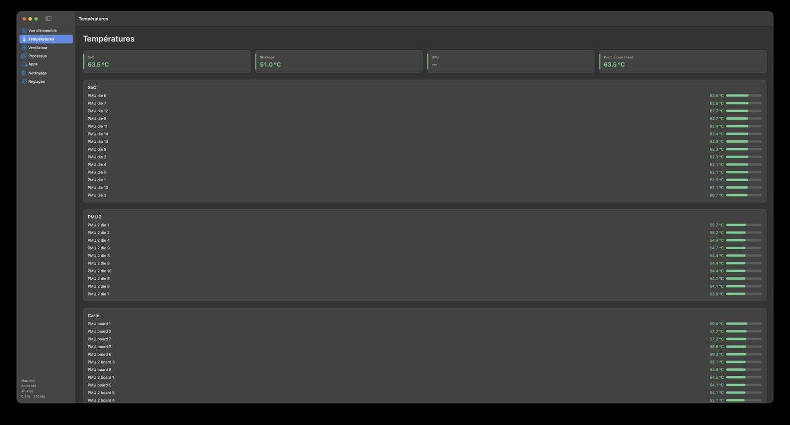
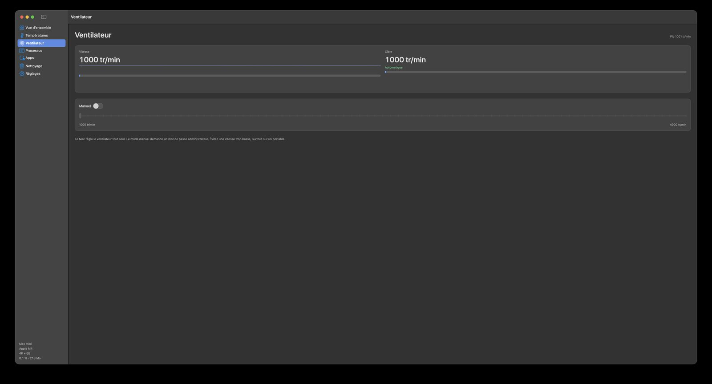
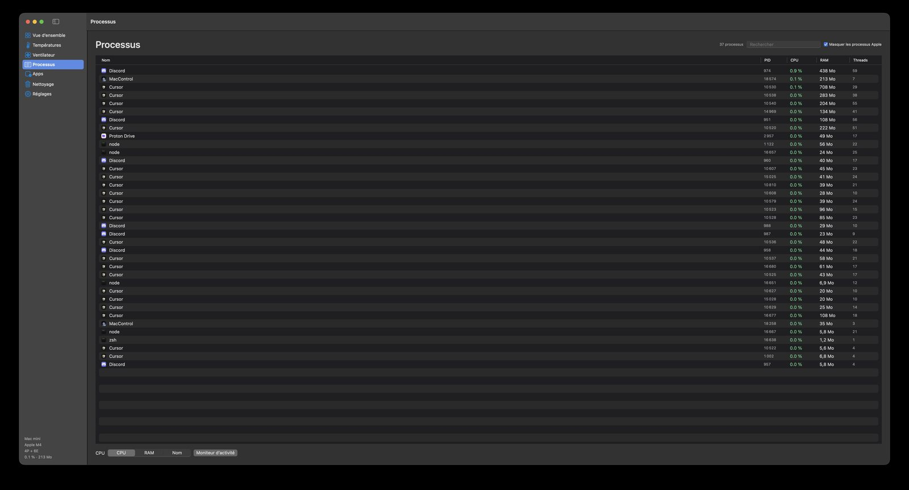
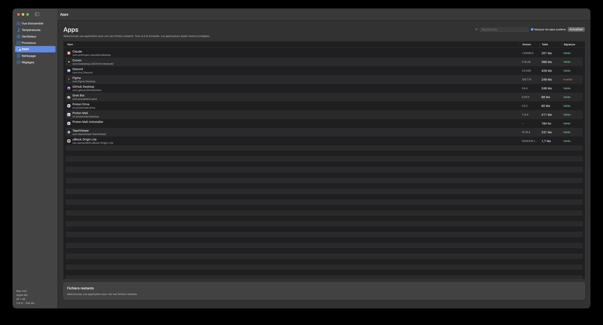
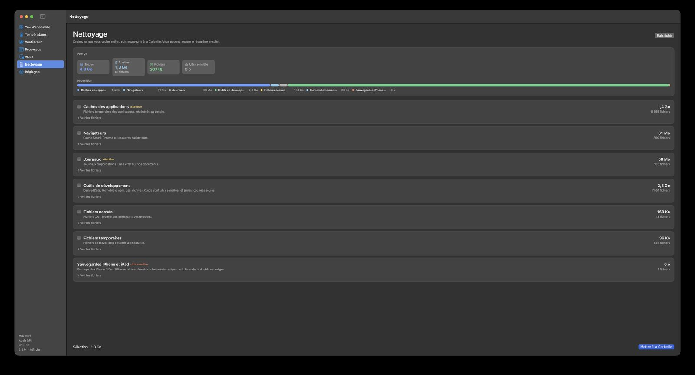
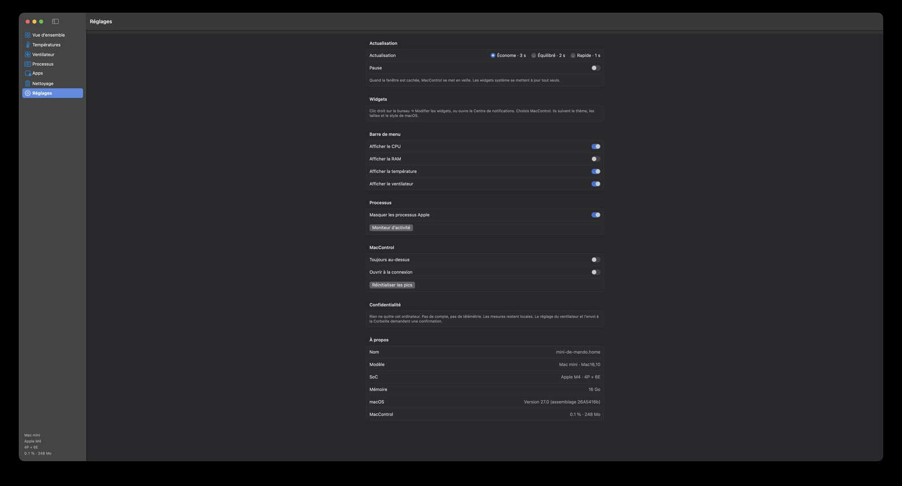

# MacControl

<p align="center">
  
</p>

Utilitaire natif pour Mac Apple Silicon. MacControl affiche l’état de la machine, désinstalle des applications avec leurs restes, et envoie caches et fichiers inutiles à la Corbeille.

Le code source est public. Les versions sont sur GitHub, hors de l’App Store. Usage personnel et éducatif autorisé. La revente est interdite.

<p align="center">
  
</p>

## Nouveautés

- Widgets WidgetKit : aperçu, processeur, mémoire, température, ventilateur, batterie, disque. Ils suivent le thème et les tailles de macOS. À ajouter depuis le bureau ou le Centre de notifications.
- Onglet nettoyage avec aperçu : volume trouvé, sélection, nombre de fichiers, espace ultra sensible, répartition par catégorie.
- Sauvegardes iPhone / iPad et archives Xcode : jamais cochées toutes seules. Une double alerte est exigée.
- Thème clair ou sombre selon macOS.

## Fonctions

- Vue d’ensemble : processeur (cœurs P et E), mémoire, disque, réseau, températures, batterie
- Températures : SoC, stockage, GPU, liste des capteurs
- Ventilateur : lecture via le SMC, réglage manuel après mot de passe administrateur
- Processus : liste, recherche, arrêt normal ou forcé
- Applications : signature, désinstallation, fichiers restants
- Nettoyage : caches, navigateurs, journaux, outils de développement, fichiers cachés
- Barre de menus : processeur, mémoire, température, ventilateur, batterie

<p align="center">
  
</p>

<p align="center">
  
</p>

<p align="center">
  
</p>

<p align="center">
  
</p>

<p align="center">
  
</p>

<p align="center">
  
</p>

## Configuration requise

- Mac Apple Silicon (M1 et suivants)
- macOS 14 Sonoma ou version ultérieure
- Les Mac Intel ne sont pas pris en charge

Validé sur Mac mini M4. Les autres Apple Silicon passent par les mêmes interfaces système.

## Installation

1. Téléchargez `MacControl.dmg` depuis la [dernière version](https://github.com/Mandalorian531/MacControl/releases).
2. Placez MacControl dans le dossier Applications.
3. Au premier lancement, clic droit, puis Ouvrir.

Gatekeeper affiche un avertissement. Le paquet est signé de manière ad hoc, sans notarisation Apple. C’est attendu.

## Widgets

1. Place MacControl dans Applications, puis lance-le une fois.
2. Clic droit sur le bureau, Modifier les widgets, ou ouvre le Centre de notifications.
3. Cherche MacControl et place les widgets.

Un clic sur un widget rouvre l’application. La mesure se rafraîchit environ toutes les cinq minutes, plus souvent si MacControl tourne.

## Confidentialité

Rien ne quitte l’ordinateur. Pas de compte, pas de télémétrie, pas de serveur.

Les mesures restent locales. Ventilateur manuel et envoi à la Corbeille demandent une confirmation. Le nettoyage se limite au compte utilisateur. Système, trousseau, Mail et clés SSH restent hors scan.

## Ventilateur

La vitesse vient du SMC. Plusieurs ventilateurs s’affichent tous. Un Mac sans ventilateur l’indique.

Le mode manuel demande un mot de passe administrateur la première fois. Une vitesse trop basse fait monter la température, surtout sur un portable. Revenez ensuite en automatique.

## Compilation

```bash
./scripts/build.sh
./scripts/package-dmg.sh
open dist/MacControl.app
```

Les outils de ligne de commande Apple suffisent. Xcode n’est pas nécessaire.

```bash
make build
make dmg
```

## Licence

[PolyForm Noncommercial 1.0.0](LICENSE). Usage personnel, étude, association et établissement scolaire : autorisé. Vendre MacControl, l’intégrer à un produit payant ou le redistribuer contre rémunération : interdit.
